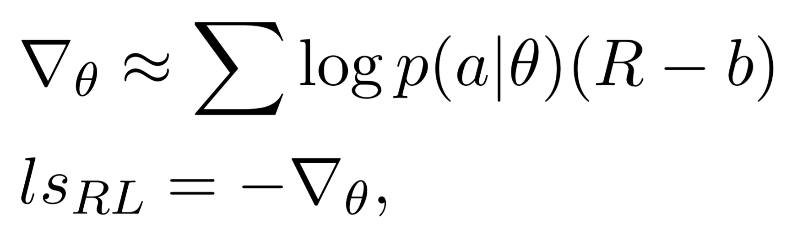

# pytorch_seq2seq-rl
A PyTorch template of seq2seq with RL training



This is a toy task of seq2seq which reversing the input list
```
[5, 6, 4, 6, 7] -> [7, 6, 4, 6, 5]
[1, 3, 7, 8, 8, 9, 9] -> [9, 9, 8, 8, 7, 3, 1]
```

## Usage

+ seq2seq
```
Dataset/generator.ipynb
model_seq2seq.ipynb
model_seq2seq-rl.ipynb
```

+ MNIST (Classification)
```
mnist_ce.ipynb
mnist_pb.ipynb
```

## Reference
+ [REINFORCE Algorithm](http://mcneela.github.io/math/2018/04/18/A-Tutorial-on-the-REINFORCE-Algorithm.html)
